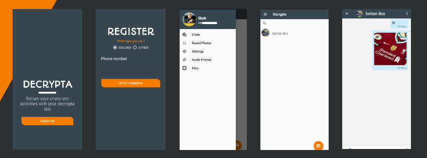

# Decrypta

**Version 1.0.0**

 

 

Decrypta is a fully functional <b>one-to-one</b> messaging app that helps <b>soldiers</b> to communicate each other and also chat with their families and friends . Its a dedicated commication system for people who works in <b>nation's secuirity</b> areas . This simple app enables users to send <b>text</b> and <b>multimedia</b> messages like images.

# Table of content 

1. [Installation](#Installation)

2. [Running the sample app](#Running-the-sample-app)

3. [Technology used](#Technology-used)

4. [More about this app](#More-about-this-app)

5. [Contributors](#Contributors)

6. [License & Copyright](#License-&-Copyright)

## Installation

You can download or clone repository to your pc .then import or add source code into your project 
* How to Clone or download : <https://docs.gitlab.com/ee/gitlab-basics/start-using-git.html#dhttps://github.com/MasayukiSuda/GPUVideo-androidownload-vs-clone>
* How to import project : <https://www.tvisha.com/blog/how-to-import-a-project-in-android-studio>

## Running the sample app

 * To run this app first you need migrate the project in to firebase console .then paste google-service.json file into project folder (project-name/app) 
after that build and run  
 * How to connect with firebase : <http://alphatech.technology/Howto-Entry-srk/Google-Services-Json-bek/>
 
**NOTE** 

   * This app can only use registered users(soldiers) . So that first you need to add that a special user number and details into database
   * On other end if you want register as civilian you need to add civilian phone number to soldier connections list

## Technology used

- Frontend : Java , xml
- Backend : Firebase

## More about this app

- This system also have an admin app that monitorize illegal activities in system  

## Contributors

- Muhsin shah (<muhsinshah21@gmail.com>)

## License & Copyright 
> Copyright (C) 2020 Muhsin Shah.  
> Licensed under the [MIT] license.  

